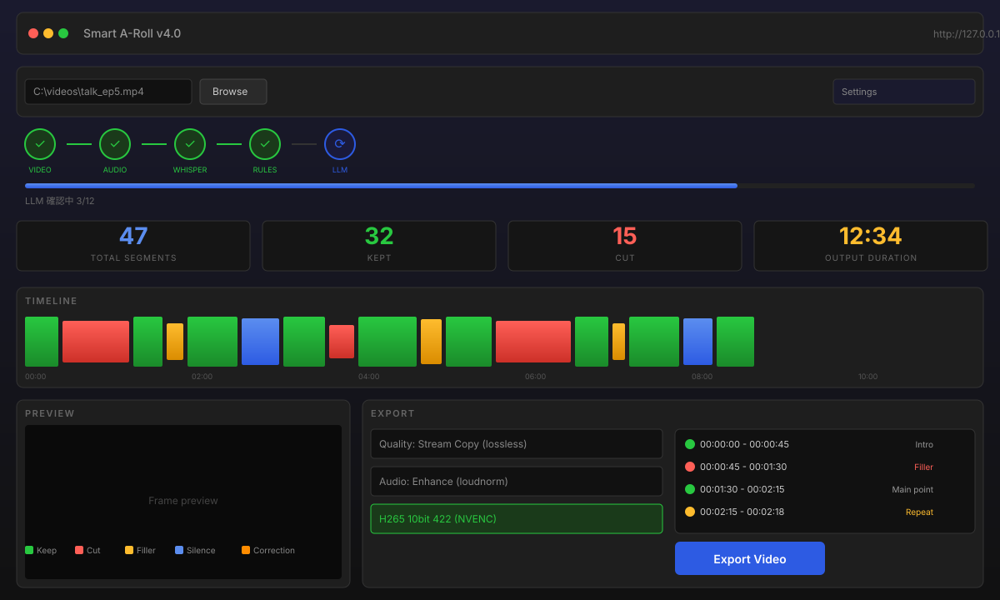

<div align="center">

# Smart A-Roll v4.0

**AI-powered A-Roll video editor — offline, local, free.**

[](https://python.org)
[](LICENSE)
[](https://github.com/juhjuhx/Davinci-AI-edit-plugins)
[](https://ffmpeg.org)
[](https://github.com/SYSTRAN/faster-whisper)
[](https://www.blackmagicdesign.com/products/davinciresolve)

</div>

---

## Overview

Smart A-Roll automates the boring part of talking-head video editing — finding and removing filler words, awkward pauses, repeated phrases, and NG takes. It runs **100% offline** on your own machine, using Whisper ASR + a rules engine + an optional local LLM.



---

## Features

| Category | Feature | Description |
|----------|---------|-------------|
| **Speech Recognition** | Whisper ASR | tiny to large-v3 models, GPU accelerated (CUDA/Metal/Vulkan) |
| | Confidence Normalization | Sigmoid mapping for intuitive 0-1 scoring |
| | VAD Filtering | Voice activity detection to skip silence regions |
| **Rules Engine** | Filler Detection | 嗯/啊/呃/那個/然後/基本上 and more |
| | Repeat Detection | Duplicate phrases within short time windows |
| | Editing Cues | Clap detection, "cut/NG/重來" voice commands |
| | Self-Correction | 不是/不對/我是說/應該是 patterns |
| **LLM Verification** | Local LLM | Qwen2.5-0.5B GGUF via llama-cpp-python |
| | Context-Aware | Reduces false positives from regex rules |
| | GPU Fallback | Graceful CPU fallback if CUDA unavailable |
| **Web UI** | Waveform Timeline | Color-coded segments (green = keep, red = cut) |
| | Live Preview | Click timeline to view video frame |
| | Razor Tool | Split segments with frame-aligned precision |
| | Keyboard Shortcuts | Q/W cut, B razor, Alt+/- zoom |
| | Draggable Panels | Customizable layout |
| **DaVinci Integration** | Clip Coloring | Green = keep, Red = cut on timeline |
| | Timeline Markers | Color-coded with AI reason annotations |
| | Frame-Accurate | Automatic FPS sync from project settings |
| **Export** | Stream Copy | Lossless concatenation in seconds |
| | H265 10bit 422 | High-quality re-encode with NVENC |
| | Audio Enhancement | Highpass/lowpass, loudnorm, denoise, compression |
| | Interchange Formats | EDL, CSV, SRT, JSON |
| **Utilities** | Background Worker | Single-thread queue with SSE progress |
| | Caching | MD5-based result caching |
| | TTS Placeholder | Edge-TTS silence generation |

---

## Quick Start

### Option 1: Download .exe (Windows, recommended)

1. Download `SmartARoll_v4.0.zip` from [Releases](https://github.com/juhjuhx/Davinci-AI-edit-plugins/releases)
2. Extract anywhere
3. Double-click `launch.bat`
4. Open `http://127.0.0.1:8888` in your browser

### Option 2: Run from Source

```bash
git clone https://github.com/juhjuhx/Davinci-AI-edit-plugins.git
cd Davinci-AI-edit-plugins
pip install -r requirements.txt
python api/app.py
```

### Option 3: CLI Mode (no GUI)

```bash
python api/app.py --video path/to/video.mp4 --output results/
```

---

## Usage Guide

### 1. Launch & Analyze

| Step | Action |
|------|--------|
| 1 | Run `launch.bat` or `python api/app.py` |
| 2 | Click "Browse Video" to select your talking-head recording |
| 3 | (Optional) Adjust settings — model size, pause gap, LLM toggle |
| 4 | Click "Start AI Analysis" |

### 2. Review & Adjust

The waveform timeline colors each segment:

- **Green** — Usable speech (kept)
- **Red** — Cut (NG, filler, commands)
- **Orange** — Filler words / self-corrections
- **Yellow** — Repetitions / hesitation
- **Blue** — Silence / pauses

| Key | Action |
|-----|--------|
| `Q` | Cut segment before cursor |
| `W` | Cut segment after cursor |
| `B` | Toggle razor mode (click to split) |
| `Space` | Play/pause preview |
| `Alt` + `+`/`-` | Zoom timeline |

### 3. Export

| Mode | When to Use |
|------|-------------|
| **DaVinci Resolve** | Need fine editing, effects, color grading |
| **Stream Copy (lossless)** | Quick export, no quality loss |
| **H265 10bit 422** | High-quality re-encode with NVENC |
| **H264** | Broad compatibility |

---

## System Requirements

| Component | Minimum | Recommended |
|-----------|---------|-------------|
| **OS** | Windows 10 | Windows 11 / Linux / macOS |
| **Python** | 3.10 | 3.11+ |
| **RAM** | 8 GB | 16 GB+ |
| **GPU** | None (CPU mode) | NVIDIA CUDA (6 GB+ VRAM) |
| **Disk** | 2 GB free | 10 GB+ for model cache |
| **FFmpeg** | Installed in PATH | Bundled with .exe release |

### Installing FFmpeg

```bash
# Windows (winget)
winget install ffmpeg

# macOS
brew install ffmpeg

# Linux
sudo apt install ffmpeg
```

Or set `FFMPEG_PATH` env var pointing to your FFmpeg directory.

---

## Project Structure

```
SmartARoll/
├── core/
│   ├── utils.py         # Shared utilities (clean_path, fix_dll_path, lazy_import)
│   ├── config.py        # Nested JSON config with deep_merge + singleton
│   ├── models.py        # Data models (SegmentType, AnalysisSegment, AnalysisResult)
│   ├── analyzer.py      # Analyzer: Whisper → Rules → LLM pipeline
│   ├── ffmpeg_gpu.py    # FFmpegRunner with NVENC auto-detect
│   ├── edl.py           # EDL/CSV/SRT/Marker/Transcript exporters
│   ├── llm.py           # llama-cpp-python LLM analyzer
│   ├── tts.py           # Edge-TTS silence placeholder
│   ├── enhance.py       # Audio pipeline (highpass → denoise → compress → loudnorm)
│   └── resolve.py       # DaVinci Resolve API integration
├── workers/
│   └── analyze_worker.py  # Background task queue with SSE progress
├── api/
│   └── app.py             # Flask server (routes + CLI mode)
├── ui/
│   └── index.html         # Single-page WebUI application
├── config.json            # User configuration
├── launch.bat             # One-click launcher
├── build.bat              # PyInstaller packaging
├── apply_to_resolve.py    # DaVinci Console script
├── pyproject.toml         # Project metadata + tool config
└── docs/
    └── screenshot.svg     # Interface preview
```

---

## Configuration

Edit `config.json` to customize:

```json
{
  "whisper": {
    "model_size": "large-v3",
    "language": "zh",
    "device": "cuda",
    "compute_type": "float16"
  },
  "analysis": {
    "confidence_threshold": 0.2,
    "pause_gap_sec": 2.0
  },
  "llm": {
    "enabled": false,
    "model_path": "qwen2.5-0.5b-instruct-q4_k_m.gguf"
  },
  "ffmpeg": {
    "prefer_nvenc": true,
    "crf": 23
  }
}
```

---

## FAQ

### Does it work without a GPU?
Yes. Falls back to CPU automatically. Use `tiny` or `base` Whisper models for reasonable speed.

### How do I use the LLM feature?
1. Download `qwen2.5-0.5b-instruct-q4_k_m.gguf` from HuggingFace
2. Set `"enabled": true` and `"model_path"` in `config.json` → `llm`
3. Install `llama-cpp-python` with CUDA support

### Can I use it with Premiere / Final Cut?
Export as EDL — most NLEs can import it.

### Data privacy?
100% offline. No data ever leaves your machine.

### DaVinci Resolve not detecting the script?
Place `apply_to_resolve.py` in `C:\ProgramData\Blackmagic Design\DaVinci Resolve\Support\Fusion\Scripts\Utility` and ensure External Scripting is set to "Local" in Preferences.

---

## Roadmap

- [x] Core analysis pipeline (Whisper + Rules + LLM)
- [x] Web UI with timeline and preview
- [x] DaVinci Resolve integration
- [x] Multiple export formats
- [ ] Multi-speaker diarization support
- [ ] Subtitle style customization
- [ ] Batch processing queue
- [ ] macOS/Linux native launcher scripts
- [ ] Plugin API for custom rules

---

## Acknowledgments

| Project | Usage |
|---------|-------|
| [faster-whisper](https://github.com/SYSTRAN/faster-whisper) | CTranslate2-optimized Whisper ASR |
| [llama-cpp-python](https://github.com/abetlen/llama-cpp-python) | Local LLM inference |
| [Flask](https://flask.palletsprojects.com) | Web server framework |
| [librosa](https://librosa.org) | Audio analysis and silence detection |
| [FFmpeg](https://ffmpeg.org) | Video/audio processing |
| [edge-tts](https://github.com/rany2/edge-tts) | Text-to-speech support |
| [DaVinci Resolve](https://www.blackmagicdesign.com/products/davinciresolve) | Professional editing platform |

---

<div align="center">

**Made for content creators, by a content creator.**

[Report Bug](https://github.com/juhjuhx/Davinci-AI-edit-plugins/issues) · [Request Feature](https://github.com/juhjuhx/Davinci-AI-edit-plugins/issues)

</div>
